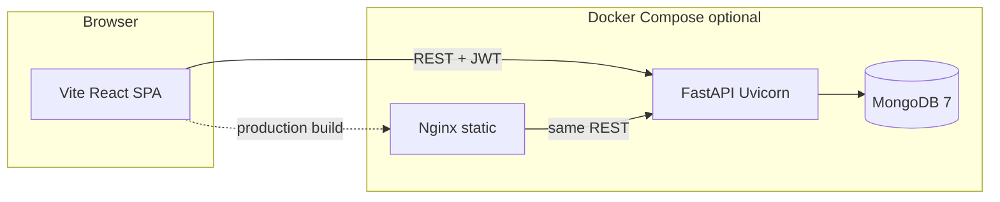

# RailVision V

**RailVision V** is a full-stack platform for railway infrastructure intelligence: upload geotagged imagery, run AI-assisted detection (YOLOv8 / Ultralytics when a model is present), visualize assets on an interactive map, track alerts and SOS incidents, and export GeoJSON or reports. It is built as a **Vite + React** SPA talking to a **FastAPI** API with **MongoDB** persistence and optional **Docker Compose** orchestration.



---

## Table of contents

1. [Features](#features)
2. [Tech stack](#tech-stack)
3. [Repository layout](#repository-layout)
4. [Prerequisites](#prerequisites)
5. [Quick start — local development](#quick-start--local-development)
6. [Environment variables](#environment-variables)
7. [Docker Compose](#docker-compose)
8. [API overview](#api-overview)
9. [AI / YOLO model](#ai--yolo-model)
10. [Demo accounts](#demo-accounts)
11. [Scripts](#scripts)
12. [Troubleshooting](#troubleshooting)
13. [License](#license)

---

## Features

- **Landing & product flows** — Marketing-style landing, platform overview, and routed app sections.
- **Dashboard map** — Leaflet-based map with railway GeoJSON layers, detection overlays, and analysis UI (change detection, results panels).
- **Authentication** — JWT login, registration, and demo login (`/api/auth/*`).
- **Imagery** — Upload with coordinates (`/api/images/upload`), listing and serving under `/uploads`.
- **Detection** — Run detection and upload-and-detect pipelines (`/api/detect`, `/api/detect/upload`).
- **Change detection** — Compare imagery over time (`/api/change-detection`).
- **Features & assets** — GeoJSON-backed features (`/api/features/*`).
- **Detections & alerts** — Historical detections and alert feeds (`/api/detections`, `/api/alerts`).
- **SOS** — Emergency incident creation and statistics (`/api/sos/*`).
- **Export** — GeoJSON, CSV, and report endpoints (`/api/export/*`).
- **Resilience** — `FALLBACK_MODE` allows the API to run without MongoDB for demos (in-memory behavior varies by route).

---

## Tech stack

| Layer | Technologies |
|--------|----------------|
| **Frontend** | Vite 8, React 19, TypeScript, Tailwind CSS 4, Radix UI primitives, React Router 7, Leaflet + react-leaflet, MUI X Charts, Zustand, Axios |
| **Backend** | Python 3.11, FastAPI, Uvicorn, Pydantic v2, Motor + PyMongo, JWT (python-jose), Pillow, OpenCV headless |
| **AI** | Ultralytics YOLO, PyTorch + torchvision (CPU-oriented Docker install; see [backend Dockerfile](backend/Dockerfile)) |
| **Data** | MongoDB 7 (Docker or local) |
| **Containers** | Docker Compose: MongoDB, FastAPI backend, Nginx-served static frontend |

---

## Repository layout

```
RailVision_V/
├── src/                      # React SPA (Vite)
│   ├── App.tsx               # Routes: /landing, /platform, /dashboard, /analytics
│   ├── components/           # UI, map, dashboard panels
│   ├── lib/                  # api.ts, store, dummy data
│   └── pages/
├── public/
├── index.html
├── vite.config.ts            # Dev server port 3005, @ alias → ./src
├── package.json              # packageManager: pnpm (recommended)
├── pnpm-lock.yaml
├── Dockerfile                # Multi-stage: pnpm build → nginx dist
├── nginx.conf                # SPA fallback for client-side routing
├── docker-compose.yml        # mongodb + backend + frontend
├── .env.example              # Reference env (see notes below)
│
├── backend/
│   ├── app/
│   │   ├── main.py           # FastAPI app, CORS, routers, /health
│   │   ├── database.py       # Mongo connect + fallback mode
│   │   ├── ml_engine.py      # YOLO singleton (optional best.pt)
│   │   └── routers/          # auth, images, detect, detections, …
│   ├── models/               # Place custom YOLO weights here (e.g. best.pt)
│   ├── uploads/              # Runtime uploads (Docker volume)
│   ├── requirements.txt
│   ├── Dockerfile
│   └── README.md             # Backend-specific docs
│
└── README.md                 # This file
```

---

## Prerequisites

- **Node.js** 20+ and **pnpm** 9 (Corepack: `corepack enable && corepack prepare pnpm@9 --activate`)
- **Python** 3.11+ (for local backend without Docker)
- **MongoDB** 6/7 locally *or* Docker / Docker Compose
- **Docker Desktop** (optional, for Compose)

---

## Quick start — local development

### 1. MongoDB

```bash
# Example: local Mongo on default port
mongod --dbpath ./data/db
# Or: docker run -d -p 27017:27017 --name mongo mongo:7
```

### 2. Backend

```bash
cd backend
python -m venv venv
source venv/bin/activate   # Windows: venv\Scripts\activate
pip install -r requirements.txt
```

Create **`backend/app/.env`** (loaded by `database.py` / `main.py`), for example:

```env
MONGODB_URI=mongodb://localhost:27017
DB_NAME=railvision_db
FALLBACK_MODE=false
JWT_SECRET=change-me-in-production
CORS_ORIGINS=http://localhost:3005,http://localhost:5173
UPLOAD_DIR=uploads
```

Then:

```bash
uvicorn app.main:app --reload --host 0.0.0.0 --port 8000
```

Interactive docs: **http://localhost:8000/docs**

### 3. Frontend

From the **repository root**:

```bash
pnpm install
echo 'VITE_BACKEND_URL=http://localhost:8000' > .env.local   # optional; default already 8000 in code
pnpm dev
```

App (dev): **http://localhost:3005**

---

## Environment variables

### Frontend (Vite)

| Variable | Purpose |
|----------|---------|
| `VITE_BACKEND_URL` | Base URL for the FastAPI server (e.g. `http://localhost:8000`). Baked in at **build** time for production images. |

Create `.env.local` in the project root for local overrides (not committed).

### Backend (`backend/app/.env`)

Typical keys (see also root [.env.example](.env.example)):

| Variable | Purpose |
|----------|---------|
| `MONGODB_URI` | e.g. `mongodb://localhost:27017` |
| `DB_NAME` | Database name |
| `JWT_SECRET` | **Change in production** |
| `JWT_ALGORITHM` / `JWT_EXPIRY_HOURS` | Token settings |
| `UPLOAD_DIR` | Upload directory (default `uploads`) |
| `CORS_ORIGINS` | Comma-separated origins; `*` enables permissive regex fallback when combined with other origins (see `main.py`) |
| `FALLBACK_MODE` | `true` to tolerate missing MongoDB for demos |

---

## Docker Compose

From the repository root:

```bash
docker compose up --build
```

| Service | Role | Host ports |
|---------|------|------------|
| **mongodb** | Data store | `27017` |
| **backend** | FastAPI | `8000` |
| **frontend** | Nginx + static Vite build | `3005` → container `80` |

- Frontend build receives `VITE_BACKEND_URL` (default in compose: `http://localhost:8000`) so the **browser** calls your machine’s mapped API port.
- Backend uploads persist in the **`uploads_data`** volume.

**Note:** The first backend image build can take several minutes while **PyTorch / Ultralytics / OpenCV** wheels download. Rebuilds are faster thanks to BuildKit pip caching in [backend/Dockerfile](backend/Dockerfile).

---

## API overview

All JSON APIs are under the backend host (e.g. `http://localhost:8000`).

| Area | Base path |
|------|-----------|
| Auth | `/api/auth/login`, `/api/auth/register`, `/api/auth/demo-login` |
| Images | `/api/images/*` |
| Detection | `/api/detect`, `/api/detect/upload` |
| Change detection | `/api/change-detection` |
| Detections | `/api/detections/*` |
| Features | `/api/features/*` |
| Export | `/api/export/geojson`, `/api/export/csv`, `/api/export/report` |
| SOS | `/api/sos/*` |
| Alerts | `/api/alerts/*` |
| Health | `/health` |
| OpenAPI | `/docs`, `/redoc` |

The SPA uses a shared Axios client in `src/lib/api.ts` with JWT attached from `localStorage`.

---

## AI / YOLO model

- Optional weights file: **`backend/models/best.pt`**
- If the file is missing, the ML engine logs a warning and **inference is disabled**; other API features can still run.
- For Docker, place weights before build or mount a volume into `/app/models` if you extend the compose file.

---

## Demo accounts

Documented in [.env.example](.env.example):

- **Admin:** `admin@railvision.ai` / `admin123`
- **User:** `demo@railvision.ai` / `demo123`

Use **demo login** via `/api/auth/demo-login` when wired in the UI, or authenticate through `/docs`.

---

## Scripts

| Command | Description |
|---------|-------------|
| `pnpm dev` | Vite dev server (port **3005**) |
| `pnpm build` | `tsc && vite build` → `dist/` |
| `pnpm preview` | Local preview of production build |
| `uvicorn app.main:app --reload` | Backend dev (from `backend/` with venv active) |

Optional: [start-all.sh](start-all.sh) if you use scripted multi-process startup.

---

## Troubleshooting

| Issue | What to try |
|-------|-------------|
| **Port 3005 in use** | Change `server.port` in `vite.config.ts` or stop the conflicting process. |
| **Port 8000 in use** | Run Uvicorn on another port, e.g. `--port 8001`, and set `VITE_BACKEND_URL` / `.env.local` accordingly. |
| **CORS errors** | Add your dev origin to `CORS_ORIGINS` or rely on defaults merged in `backend/app/main.py`. |
| **Docker `yarn.lock` / `pnpm`** | Root image uses **pnpm** + `pnpm-lock.yaml` (see root [Dockerfile](Dockerfile)). |
| **Docker COPY / `node_modules` conflict** | Ensure root `.dockerignore` excludes `node_modules` and `dist` before `COPY . .` |
| **Slow `pip install` in Docker** | Expected on first build (large ML wheels). Rebuilds use pip cache mount in the backend Dockerfile. |

---

## License

This project is provided as-is for demonstration and hackathon-style development. Add a `LICENSE` file and update this section when you publish formally.

---

**RailVision V** — spatial intelligence for rail operations.
