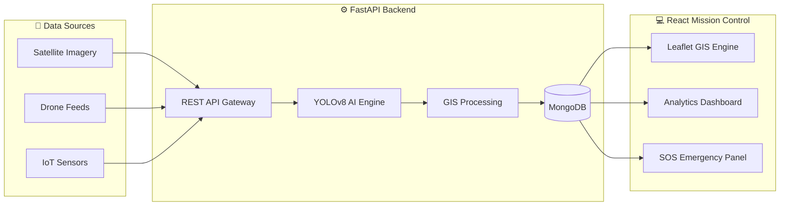
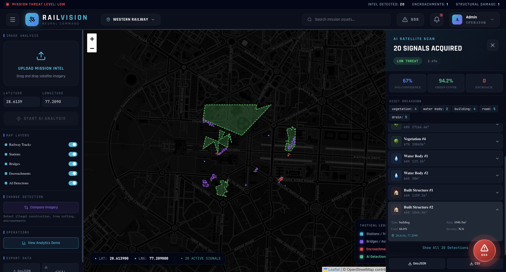
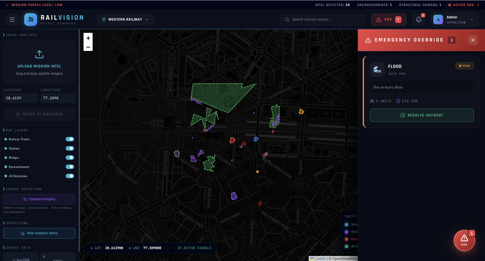

<div align="center">

# 🚆 RailVision 

### **AI-Powered Spatial Intelligence & Emergency Response Platform for Indian Railways**

<p>
  
  
  
  
  
</p>

> **Detect. Monitor. Protect. Respond.**

---

🔗 **Live Demo** · *(Add deployment link)*  
📂 **Repository** · https://github.com/yourusername/RailVision

</div>

---

# ⚡ What is RailVision ?

RailVision  is an **AI-powered geospatial intelligence platform** designed for modern railway infrastructure monitoring and emergency response.

The platform combines:

- 🛰️ Satellite imagery
- 🚁 Drone intelligence
- 🤖 AI-powered detection
- 🌍 GIS mapping
- 🚨 SOS emergency systems

to create a **real-time digital railway asset intelligence ecosystem**.

---

# 🚨 Why This Matters

Indian Railways manages one of the world’s largest railway infrastructures:

- Railway lands
- Bridges
- Drainage systems
- Water bodies
- Roads
- Green cover
- Trackside infrastructure

Yet much of this is still tracked using:

- spreadsheets
- paper records
- manual inspections

This causes:

❌ Illegal encroachments  
❌ Flooding & drainage failures  
❌ Revenue leakage  
❌ Delayed emergency response  
❌ Poor infrastructure visibility  

👉 RailVision AI transforms this into a **real-time AI-driven spatial intelligence system**.

---

# 🌟 Core Features

---

## 🛰️ AI-Powered Spatial Asset Detection

Automatically detects:

- Buildings & railway structures
- Roads & pathways
- Water bodies
- Drains & sewage systems
- Trees & green cover
- Open spaces

using:

- YOLOv8
- SegFormer
- OpenCV

---

## 🌍 Interactive GIS Intelligence Dashboard

Visualize detections directly on:

- Leaflet GIS maps
- GeoJSON overlays
- Railway infrastructure layers

Features:

- Layer toggles
- Heatmaps
- Detection overlays
- Spatial analytics
- Coordinate tracking

---

## 🚨 Emergency SOS Response System

Real-time railway emergency intelligence:

- Flood alerts
- Encroachment alerts
- Emergency route mapping
- Nearby road access
- Risk heatmaps
- Incident management

---

## 🔄 Change Detection Engine

Compare historical and current imagery to detect:

- Illegal construction
- Tree cutting
- Water body shrinkage
- Infrastructure changes

using:

- OpenCV
- SSIM image comparison

---

## 📊 Advanced Analytics Engine

Generate:

- Asset statistics
- Green cover %
- Water body analysis
- Encroachment metrics
- Infrastructure reports

with:

- Recharts
- MUI-X analytics

---

## 📦 GeoSpatial Export System

Export intelligence data as:

- GeoJSON
- CSV
- GIS-ready reports

for downstream government/GIS systems.

---

# 🧠 System Workflow

```text
Satellite / Drone Imagery
            ↓
AI Detection Pipeline
(YOLOv8 + SegFormer)
            ↓
GIS Polygon Extraction
            ↓
GeoJSON Generation
            ↓
Interactive Railway Dashboard
            ↓
Emergency Intelligence & Alerts
            ↓
Analytics + Export System
```

---

# 🏗️ System Architecture



---

# 🛠️ Tech Stack

| Layer | Technology |
|------|-------------|
| **Frontend** | React 19, Vite, TypeScript, Tailwind CSS |
| **GIS Visualization** | Leaflet.js, React Leaflet |
| **Backend** | Python,FastAPI, Uvicorn |
| **Database** | MongoDB |
| **ML FrameWork** | Ultralytics YOLOv8, PyTorch |
| **Pre-Trained Model** | YOLOv8|
| **Image Processing** | OpenCV, Pillow |
| **GIS Processing** | GDAL, Rasterio, GeoPandas |
| **State Management** | Zustand |
| **Charts** | Recharts, MUI-X |
| **Authentication** | JWT |
| **Deployment** | Docker, Vercel |

---

# 📂 Repository Structure

```text
RailVision/
├── frontend/
│   ├── src/
│   ├── components/
│   ├── pages/
│   ├── map/
│   └── layouts/
│
├── backend/
│   ├── app/
│   ├── ai/
│   ├── gis/
│   ├── routers/
│   ├── models/
│   └── uploads/
│
├── docker-compose.yml
├── Dockerfile
└── README.md
```

---

# 🚀 Getting Started

---

## 🔧 Requirements

- Node.js 20+
- Python 3.11+
- MongoDB
- Docker (optional)

---

# ⚙️ Local Development Setup

---

## 1️⃣ Clone Repository

```bash
git clone https://github.com/yourusername/RailVision.git
cd RailVision
```

---

## 2️⃣ Backend Setup

```bash
cd backend

python -m venv venv

source venv/bin/activate
# Windows:
# venv\Scripts\activate

pip install -r requirements.txt

uvicorn app.main:app --reload
```

Backend:
`http://localhost:8000`

Docs:
`http://localhost:8000/docs`

---

## 3️⃣ Frontend Setup

```bash
pnpm install

pnpm dev
```

Frontend:
`http://localhost:3005`

---

# 🐳 Docker Deployment

```bash
docker compose up --build
```

Services:

| Service | Port |
|---------|------|
| Frontend | 3005 |
| Backend | 8000 |
| MongoDB | 27017 |

---

# 📡 API Overview

| Module | Endpoint |
|--------|-----------|
| Auth | `/api/auth/*` |
| Detection | `/api/detect/*` |
| Images | `/api/images/*` |
| SOS | `/api/sos/*` |
| Alerts | `/api/alerts/*` |
| Export | `/api/export/*` |
| Change Detection | `/api/change-detection` |

---

# 🤖 AI Models

RailVision AI integrates:

## 🎯 YOLOv8
Used for:
- infrastructure detection
- roads
- buildings
- water bodies

---

## 🧩 SegFormer
Used for:
- semantic segmentation
- vegetation analysis
- green cover intelligence

---

# 🚨 Emergency SOS Intelligence

One of the platform’s most powerful capabilities.

Features:

- Incident creation
- Flood alerts
- Encroachment warnings
- GIS emergency mapping
- Nearest safe route analysis
- Real-time railway emergency dashboard

---

# 📸 Screenshots

> Add real screenshots here (VERY IMPORTANT)

| Dashboard | GIS View | SOS System |
|-----------|-----------|-------------|
|  |  |  |

---

# 🗺️ Roadmap

- 📡 Live drone stream processing
- ☁️ Cloud GIS infrastructure
- 🧠 Predictive maintenance AI
- 📍 Real-time railway sensor integration
- 🛰️ Advanced satellite analytics
- 🚄 Digital twin infrastructure modeling

---

# 🤝 Author

Built by **Yugank Fatehpuria**

Focused on building:
- AI systems
- GIS platforms
- real-time intelligence products
- impactful infrastructure technology 🚀

---

<div align="center">

## 🚆 RailVision 

**Spatial Intelligence for Modern Rail Infrastructure**

Made with ❤️ using AI + GIS + Computer Vision

</div>
